# Supervised Learning

CS 440 - Assignment 2  
Group: Akhil Velagapudi, Nithin Tammishetti

## Question 1

### 1,2)
Code for the Perceptron classifier is in `1-digit-classification/perceptron.py`.

A faster version of the classifier is implemented in `1-digit-classification/numceptron.py`.
This version uses numpy arrays for faster, vectorized computations, allowing us to train the
model for longer and on larger datasets.
#


Code for the SVM classifier is in `1-digit-classification/svm.py`.

This classifier simply uses scikit-learn's LinearSVM class to address the digit
classification problem.
#
Code for the Multi-Layer Neural Network is in `1-digit-classification/mlp.py`.

The neural network was implemented using numpy arrays for efficient computation.
It is a three layer network with a variable hidden layer size. For the report,
200 hidden nodes were used. The network can be trained using regular gradient decent,
or a batch based stochastic gradient descent.


The network parameters and settings used for this report:
```
learning rate = 1
regularization strength = 1e-4
decay rate = 0.99
batch = True
batch size = 200
``` 

#

### 3)
The following plots were generated by training each classifier on variable amounts
of the training set. The classifiers were then evaluated on the entire training set.


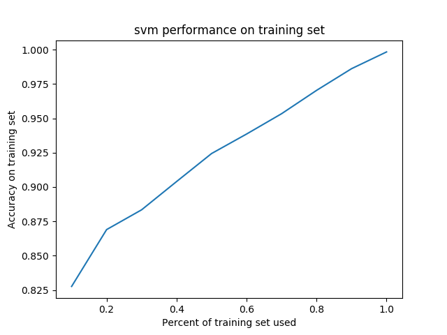


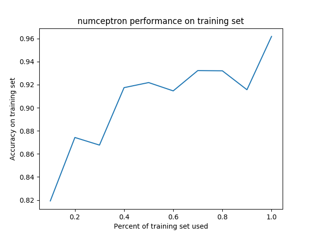


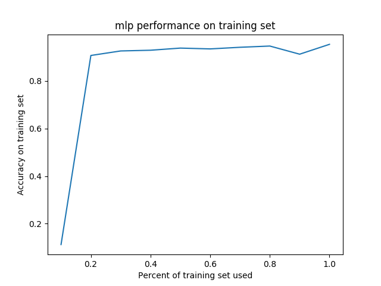

### 4)
The following plots were generated by training each classifier on variable amounts
of the training set. The classifiers were then evaluated on the entire test set.


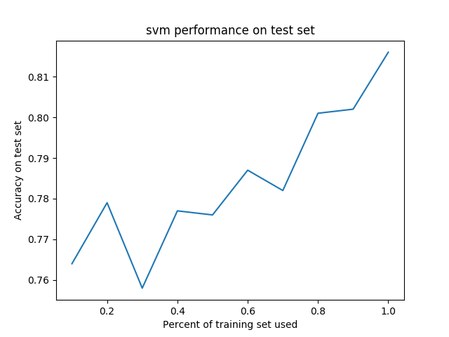


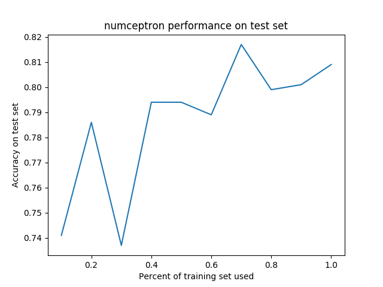


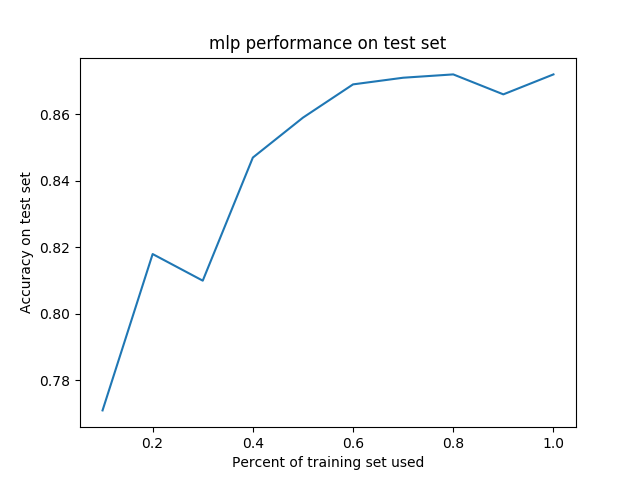


### 5)

For the perceptron classifier, there were not many hyper parameters to tune.
The algorithm basically trains for a specified amount of iterations on the given training set
and learns a set of weights for each class. However, the perceptron is able to achieve relatively
high accuracy, reaching about 80% accuracy on the test set when trained on the entire training set.
It of course performs much better on the training set itself. There is not much room
for improvement for this classifier, but training it on bigger datasets for longer could help. However,
based on the trend, there is not much to be gained by increasing training set size alone.

The SVM classifier reaches an exceptionally high accuracy on the training set, reaching almost 100%.
However, it performs much worse on the test set itself, hovering at around 80%. But this was only a simple,
linear SVM, so the performance could easily be improved by using certain kernels and by adjusting
the regularization parameter properly. The SVM also seems to be gaining accuracy in response to the increase
in training set size.

The Multi-Layer perceptron is the slowest of the group but it consists of a relatively complex model
that could gain a lot from finetuning. I used the cross entropy loss function to compute the loss and back-
propagated the graient to the inputs (the weights) by computing and chaining the gradients at each level.
The MLP performs the best out of the three classifiers when it is evaluated on the test set. But this was done with little fine tuning and a with a relatively low number
of iterations. 

For the purpose of generating these graphs, we used only 200 nodes in the hidden layer.
However, when properly tuned and trained for a larger amount of time, the classifier approaches 95%
accuracy on the test set. This was acheived by using the validation set to set the regulerization
and learning rate. The algorithm has a lot of room for improvement as it is complex enough and does not
suffer from a high bias. The biggest improvements could be gained in the futer by crossvalidating and
setting the important parameters such as the regularization and learning rate to ideal amounts. It could
also benefit from adding more hidden layers and trying different loss functions and otimization methods.


\newpage
## Question 2

### a)
The tree correctly categorizes all the provided examples.

### b)
Code is provided in `2-acceptance-tree/acceptance.py`.  
Algorithm generates the following tree:
```
GPA Class
|-- N (3.2 >= GPA)
|-- P (GPA >= 3.9)
|-- Published (3.9 > GPA > 3.2)
    |-- P (yes)
    |-- University (no)
        |-- N (rank 1)
        |-- N (rank 3)
        |-- P (rank 2)
```
using the following calculations to determine information gain:
```
Information gain:

['University', 'Published', 'Recommendation', 'GPA Class']
[0.11036014405977645, 0.006900300371591395, 0.11036014405977645, 0.6222849157562068]
Best attribute: GPA Class

['University', 'Published', 'Recommendation']
[0.17095059445466854, 0.4199730940219749, 0.0]
Best attribute: Published

['University', 'Recommendation']
[0.9182958340544896, 0.0]
Best attribute: University
```

### c)
The tree generated in part b is equivalent to the tree provided but this is a coincidence. It is possible for the algorithm to arrive at a decision tree that is simpler than the actual decision tree used to classify the samples. Also, there might be noise in the available data which the algorithm fails to ignore. 

\newpage
## Question 3
Code is provided in `3-svm/svm.py`.

### a)
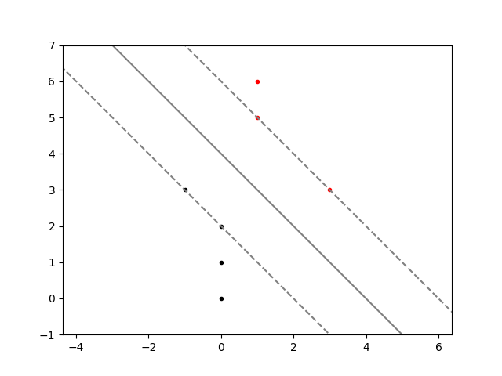

### b)
w = [1 1]<sup>T</sup>  
b = -4

\newpage
### c)
(no change)  
w = [1 1]<sup>T</sup>  
b = -4

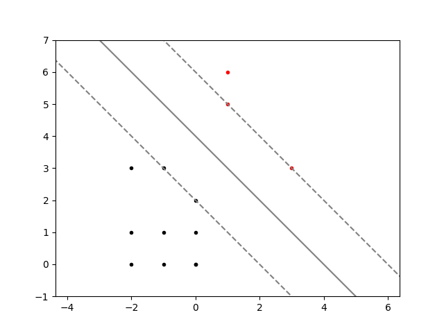

\newpage
## Question 4
Code is provided in `4-perceptron-learning/perceptron-learning.py`.

### a)
The alpha channel of each line represents the iteration. The darker the line, the later the iteration.
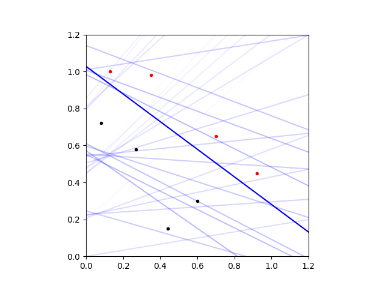

### b)
Perceptron did reach a perfect classification.

\newpage
### c)
The alpha channel of each line represents the iteration. The darker the line, the later the iteration.

w = [0.200 -0.306]<sup>T</sup>  
error (proportion of misclassified samples) = 25%

Inputs are seperated at i1 = 0.6536

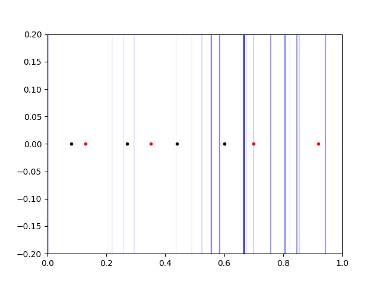

\newpage
## Question 5

### a)
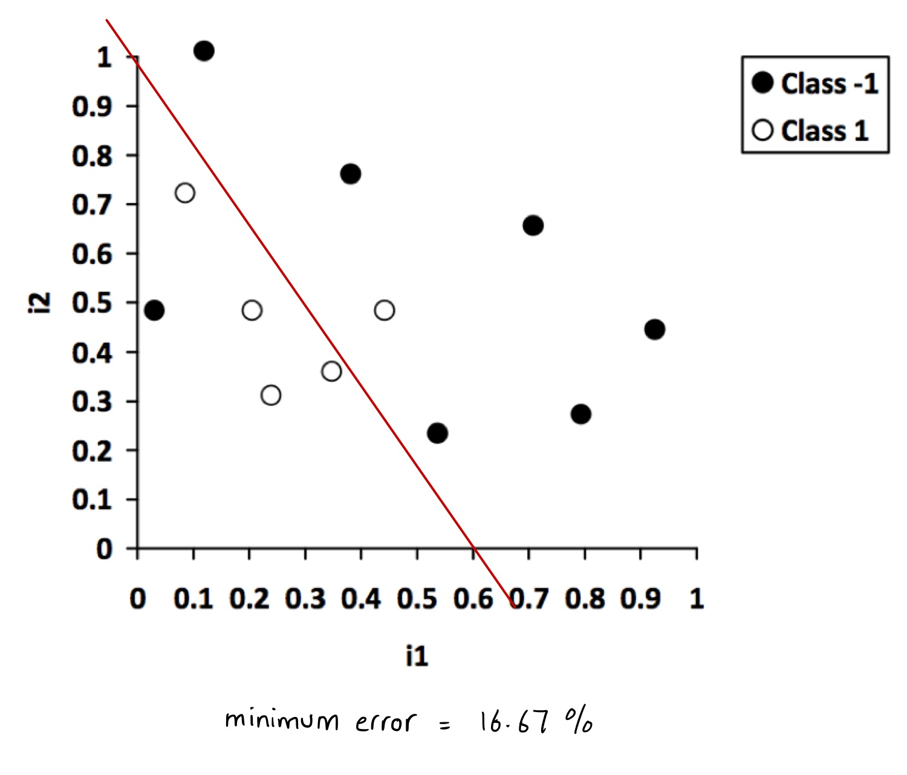

\newpage
### b)

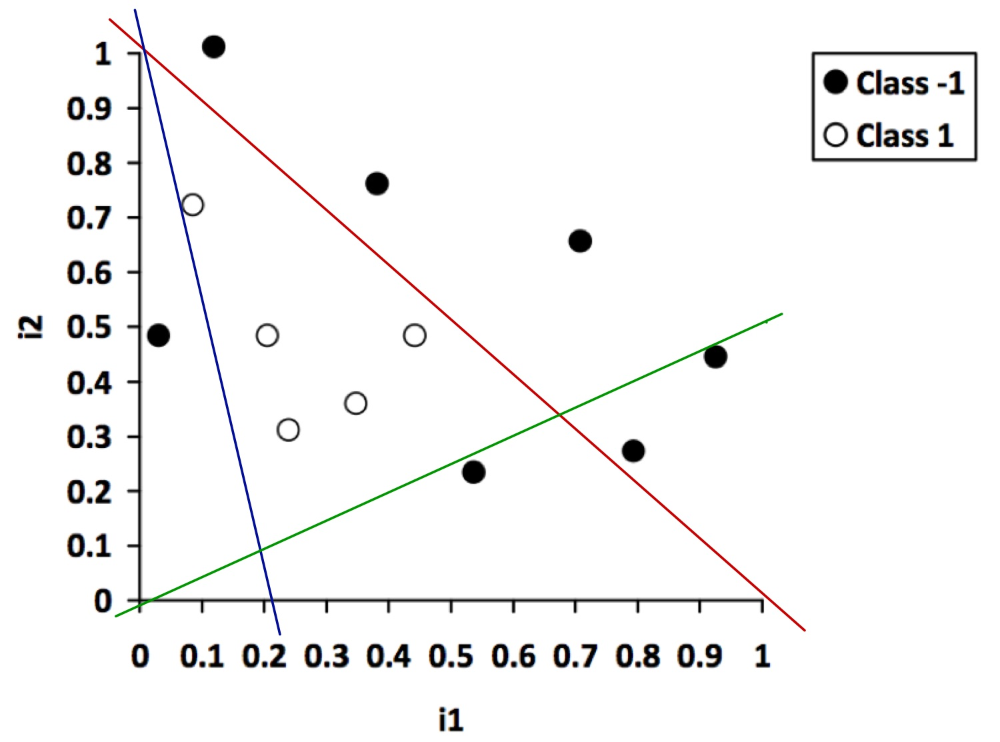

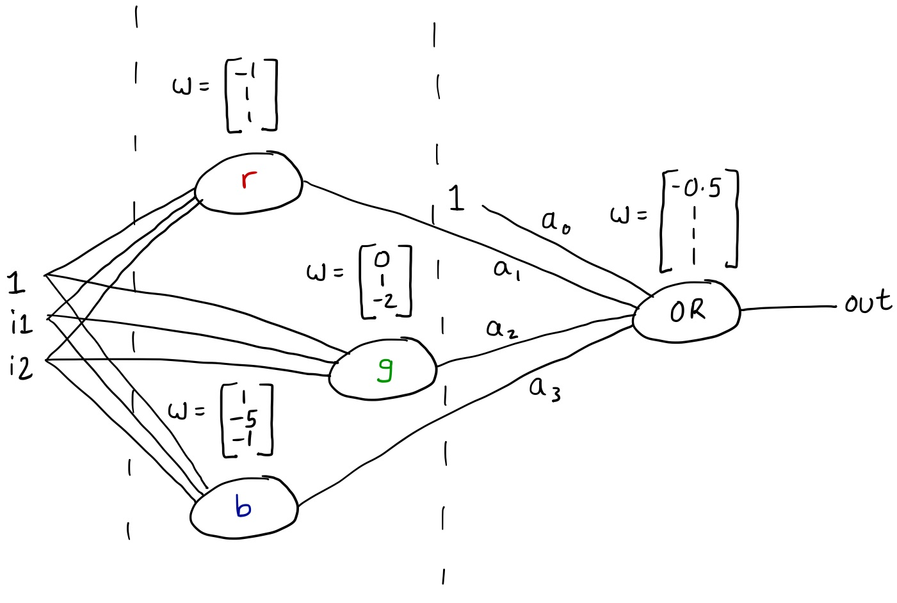