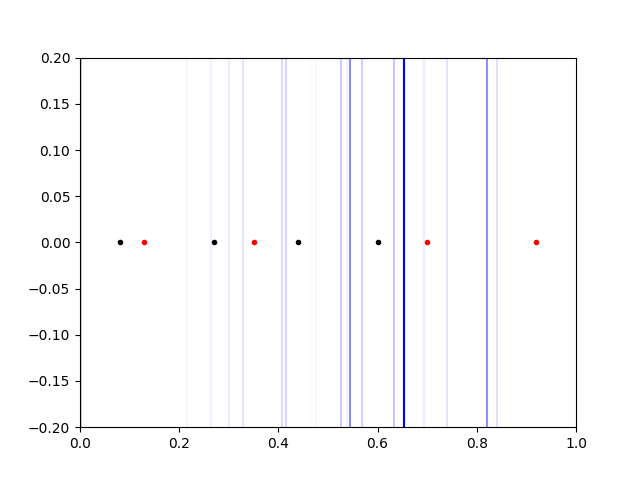

# Supervised Learning

CS 440 - Assignment 2  
Group: Akhil Velagapudi, Nithin Tammishetti

## Question 1


## Question 2

### a)
The tree correctly categorizes all the provided examples.

### b)
Code is provided in `2-acceptance-tree/acceptance.py`. Algorithm generates the following tree:
```
GPA Class
├── N (3.2 >= GPA)
├── P (GPA >= 3.9)
└── Published (3.9 > GPA > 3.2)
    ├── P (yes)
    └── University (no)
        ├── N (rank 1)
        ├── N (rank 3)
        └── P (rank 2)
```

### c)
The tree generated in part b is equivalent to the tree provided but this is a coincidence.


## Question 3
Code is provided in `3-svm/svm.py`.

### a)


### b)
w = [1 1]<sup>T</sup>  
b = -4

### c)
(no change)  
w = [1 1]<sup>T</sup>  
b = -4


## Question 4
Code is provided in `4-perceptron-learning/perceptron-learning.py`.

### a)


### b)
Perceptron did reach a perfect classification.

### c)
w = [0.200 -0.306]<sup>T</sup>  
error (proportion of misclassified samples) = 25%
